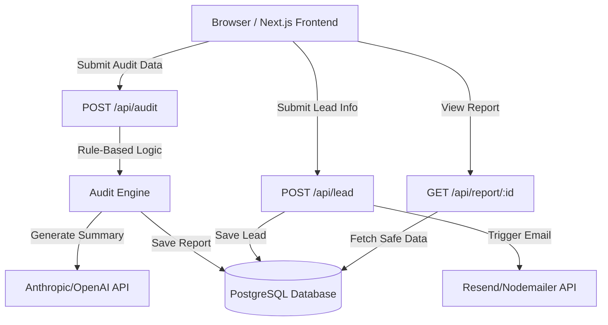

# System Architecture

## System Diagram

## Data Flow
1. **Input Phase**: User interacts with a multi-step form built with Next.js state management. State is persisted in `localStorage` to survive page reloads.
2. **Audit Phase**: Upon submission, the frontend calls the backend `POST /api/audit`. The `Audit Engine` evaluates the data deterministically.
3. **Synthesis Phase**: The backend makes a structured prompt call to Anthropic (Claude 3.5 Sonnet) to generate a personalized executive summary.
4. **Storage & Result Phase**: The backend saves the full audit to PostgreSQL, returning an `id`. The frontend displays results immediately.
5. **Lead Capture Phase**: When the user provides their email, a `POST /api/lead` request is fired. It stores the lead tied to the audit `id` and sends a confirmation email.

## Stack Reasoning
- **Next.js (Frontend)**: Ideal for rapid development of multi-step interactive forms, strong SEO capabilities for the marketing aspects, and Tailwind integration out-of-the-box.
- **Node.js/Express (Backend)**: Lightweight, extremely flexible, easy to separate complex rule-based calculation logic from the frontend build process.
- **PostgreSQL**: Ensures structured persistence of audit data which has a rigid schema (tools, costs, leads).
- **Tailwind CSS**: Promotes utility-first rapid styling that maintains a minimalistic, clean UI suitable for enterprise-grade SaaS tools.

## Scaling Plan (10k users/day)
- **Frontend Optimization**: Since the frontend does not require SSR for the form, the React components can be statically exported and cached heavily on a CDN.
- **Backend Scaling**: The backend logic is mostly CPU-bound due to the rules engine, but 10k requests/day is under 1 request/second. A single instance on Render/Fly is sufficient. We will scale horizontally to 2-3 instances for high availability.
- **Database Scaling**: Supabase PostgreSQL easily handles 10k writes/day. Connection pooling via PgBouncer can be enabled if connections exceed limits.
- **LLM Rate Limits**: Implement a queue (e.g., BullMQ) for the Anthropic/OpenAI requests to handle traffic spikes and respect API rate limits smoothly. Fallback generic text will be provided if the API fails or rate limits.
