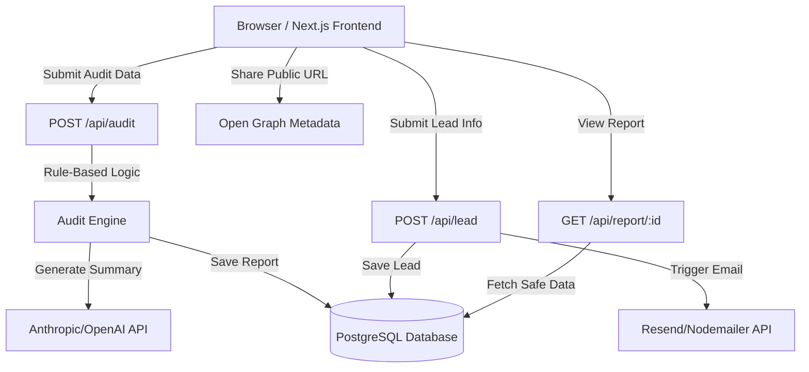

# System Architecture

## System Diagram

---

# Data Flow

## 1. Input Phase
The user interacts with a multi-step audit form built using Next.js and React state management. Form state is persisted in `localStorage` so users do not lose progress on accidental refreshes or browser restarts.

The form collects:
- AI tools being used
- Current pricing plans
- Monthly spend
- Number of seats
- Team size
- Primary use case (coding, research, writing, mixed, etc.)

---

## 2. Audit Phase
After submission, the frontend sends a `POST /api/audit` request to the backend.

The backend runs a deterministic rules-based audit engine instead of relying on AI for financial calculations. This ensures recommendations remain explainable, reproducible, and financially defensible.

Example rules:
- If a team has fewer than 3 developers but uses ChatGPT Team, recommend ChatGPT Plus instead.
- If API usage cost exceeds the equivalent fixed-seat plan, recommend switching pricing models.
- If the use case is primarily coding, compare Cursor Pro against GitHub Copilot Business and Claude integrations.
- If a company is paying retail enterprise pricing, surface potential savings through infrastructure credits.

The engine calculates:
- Current monthly spend
- Recommended tools/plans
- Monthly savings
- Annual savings
- Recommendation confidence and reasoning

---

## 3. AI Summary Generation
Once the audit calculations are complete, the backend sends structured audit data to Anthropic Claude 3.5 Sonnet (fallback-compatible with OpenAI models).

The LLM generates:
- A concise executive summary
- Personalized optimization recommendations
- Spend efficiency commentary

If the LLM API fails or rate limits occur, the system gracefully falls back to a templated summary response.

---

## 4. Storage & Results Phase
The backend stores audit results inside PostgreSQL and generates a unique public report ID.

The frontend immediately renders:
- Total monthly savings
- Total annual savings
- Per-tool breakdowns
- Recommended actions
- Personalized AI summary

Sensitive lead information is never exposed in public report routes.

---

## 5. Lead Capture Phase
After users receive value from the audit, the frontend optionally collects:
- Email
- Company name
- Role
- Team size

The backend:
1. Stores the lead data
2. Associates it with the audit report
3. Sends a transactional confirmation email using Resend/Nodemailer

For high-savings audits, the UI prominently surfaces Credex consultation CTAs.

---

## 6. Shareable Reports & Open Graph
Each audit receives a public UUID-based URL.

Public reports:
- Exclude identifying information
- Only expose tool stack and savings data
- Generate dynamic Open Graph metadata for social sharing previews

This allows audits to be shared on Twitter, Slack, Discord, and Hacker News with rich previews.

---

# Abuse Protection

To reduce spam and automated abuse:
- Honeypot fields are implemented in lead forms
- Basic rate limiting is applied to API endpoints
- Validation is enforced both client-side and server-side

A lightweight anti-abuse approach was intentionally chosen instead of CAPTCHA to minimize friction during the user flow.

---

# Stack Reasoning

## Next.js (Frontend)
Next.js provides:
- Fast development velocity
- Strong routing support
- Excellent SEO capabilities
- Optimized asset handling
- Easy Open Graph integration
- Flexible rendering options

It is well-suited for a product that combines SaaS functionality with marketing-oriented landing pages.

---

## Node.js + Express (Backend)
Express provides:
- Lightweight API development
- Clear separation of business logic
- Flexibility for rule-based audit processing
- Easy integration with external APIs and databases

The audit engine logic remains isolated from frontend rendering concerns.

---

## PostgreSQL
PostgreSQL was selected because:
- Audit data has a structured schema
- Relational consistency matters
- Reporting queries are predictable
- Lead records and audit reports require durable persistence

The schema design is optimized for future analytics and benchmarking features.

---

## Tailwind CSS
Tailwind CSS enables:
- Rapid UI iteration
- Consistent spacing and typography
- Maintainable component styling
- Responsive layouts with minimal custom CSS

This helped achieve a polished SaaS-style interface quickly.

---

# Scaling Plan (10k audits/day)

## Frontend Scaling
The frontend can be heavily CDN-cached because most pages are static or semi-static.

Future optimizations:
- Edge caching
- Image optimization
- Partial static generation
- Lazy-loading heavy result components

---

## Backend Scaling
The audit engine is lightweight and deterministic.

10k audits/day is comfortably manageable on small cloud infrastructure, but horizontal scaling can be added easily using:
- Multiple Express instances
- Load balancing
- Stateless API design

The architecture intentionally avoids unnecessary microservice complexity.

---

## Database Scaling
PostgreSQL can comfortably handle this scale.

Future optimizations:
- PgBouncer connection pooling
- Read replicas
- Background archival jobs
- Indexed reporting queries

---

## LLM Rate Limits
LLM requests are the primary scaling bottleneck.

To handle spikes:
- Queue-based processing (BullMQ or Redis queues)
- Retry handling
- Graceful fallbacks
- Response caching for similar summaries

This ensures the core audit experience still functions even during AI provider outages.

---

# Future Improvements

If given additional development time, the system could evolve with:
- Benchmark comparisons by company size
- PDF exports
- Embedded widget distribution
- Referral systems
- Usage analytics dashboards
- Multi-tenant admin tooling
- AI-powered trend forecasting
- Spend anomaly detection

The current architecture keeps these future extensions feasible without major rewrites.